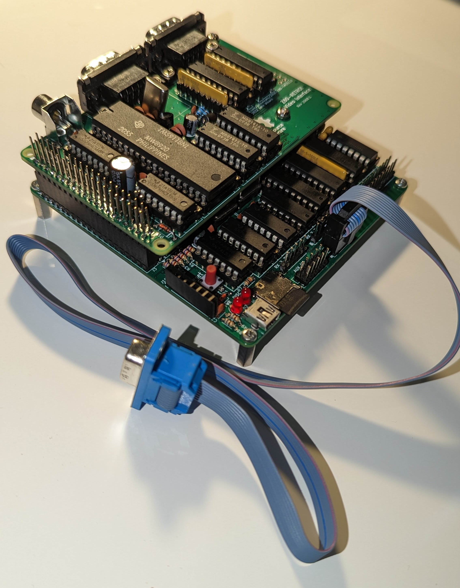
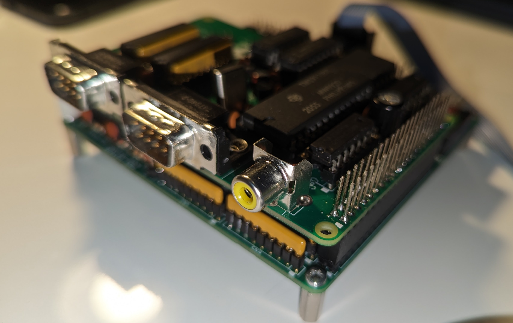
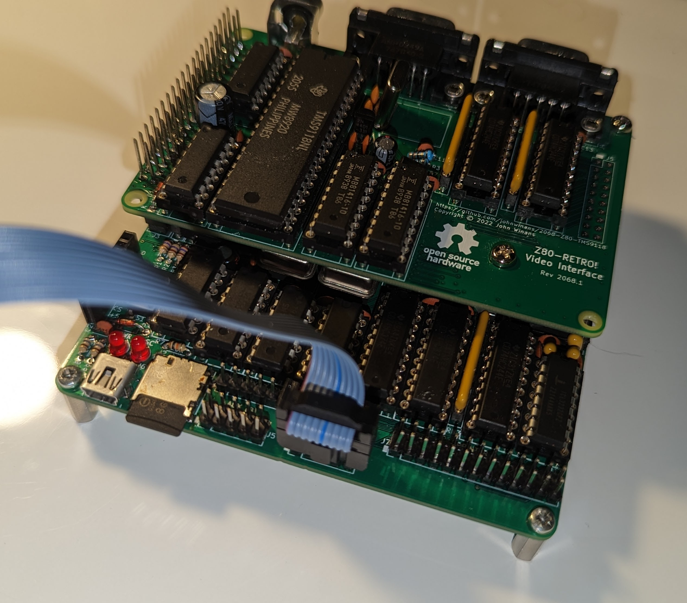

# Preface

Having recently completed a Z80-Retro board, it became apparent that some form
of documented manual might be useful for other folks doing the same thing.

The Z80-Retro is a unique retro project in that the level of detail provided
by John is outstanding.  There are a few other creators who have done similar
things.

- Ben Eater - [8-bit CPU](https://www.youtube.com/watch?v=HyznrdDSSGM&list=PLowKtXNTBypGqImE405J2565dvjafglHU&pp=iAQB) on breadboards and 6502 on breadboards.
- James Sharman - [Pipelined CPU](https://www.youtube.com/@weirdboyjim/).
- Fabian Schuiki - [Build a superscaler CPU](https://www.youtube.com/watch?v=bwjMLyBU4RU&list=PLyR4neQXqQo5nPdEiMbaEJxWiy_UuyNN4&pp=iAQB)

Perhaps there are more, but none that take you through the journey of designing,
building and programming a retro project that runs CP/M with the same careful
consideration for the viewer's learning experience as John's Basement.

Before you even have the supplies you need to get started, you really should
join the Z80 Retro! Discord Server, introduce yourself, and join the community.

Here are some photos of my build showing the Z80-Retro! with the VDP duaghter board.

Rock On!

Dave Latham - aka (production-dave)

