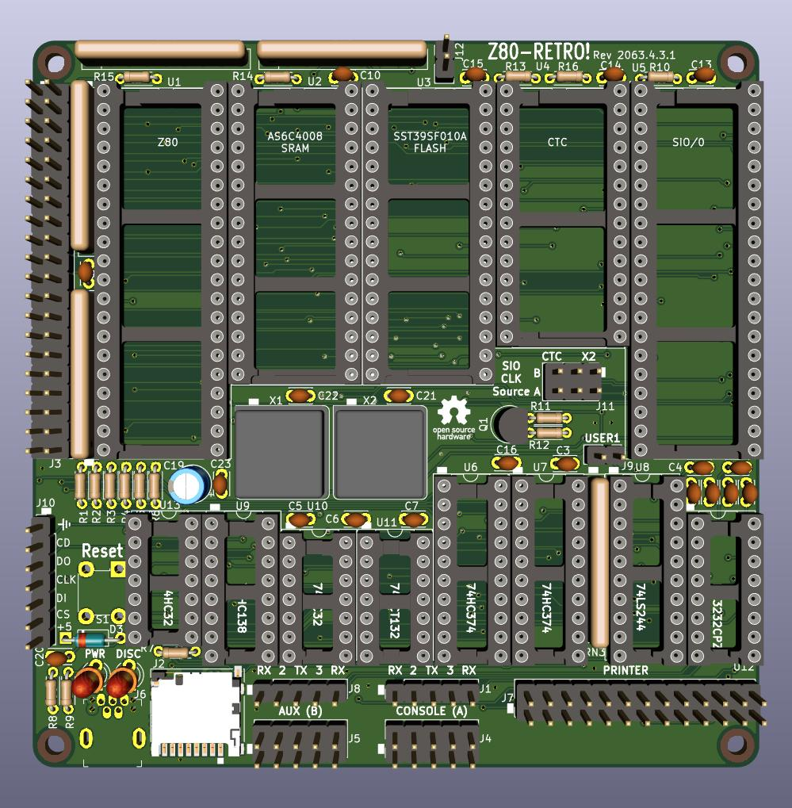

# Z80-Retro-Manual

So you've decided to build the Z80-Retro Single Board Computer! Welcome to the
club of retro enthusiasts.



This document is intended as a guide to building and setting up your Retro.  It
is complimentary to the series of YouTube videos that probably brought you here
in the first place.

- [Z80-Retro GitHub Organization](https://github.com/Z80-Retro)
- [Z80-Retro YouTube Playlist](https://www.youtube.com/playlist?list=PL3by7evD3F51Cf9QnsAEdgSQ4cz7HQZX5)

The document is split into different sections.  It is recommended to read
through all the documents in the order provided below at least once before
starting the project.  You might need to refer back to this guide multiple times
so go ahead and bookmark this page right now.

## Sections

- [Preface](./PREFACE.md)
- General
  - [Z80-Retro Architecture](./Z80-RETRO-ARCHITECTURE.md)
  - [Z80-Retro Build](./Z80-RETRO-BUILD.md)
  - [Z80-Retro Memory](./Z80-RETRO-MEMORY.md)
- Software
  - [Z80-Retro Development Environment](./Z80-RETRO-DEVEVELOPMENT.md)
  - [Z80-Retro Firmware](./Z80-RETRO-FIRMWARE.md)
  - [Z80-Retro Software](./Z80-RETRO-SOFTWARE.md)
  - [Z80-Retro File Transfer](./Z80-RETRO-FILE-XFER.md)
- Daughter Boards
  - [Z80-Retro VDP Build](./Z80-RETRO-VDP-BUILD.md)
  - [Z80-Retro VDP Software](./Z80-RETRO-VDP-SOFTWARE.md)
- [Using the EtchedPixels EmulatorKit](./Z80-RETRO-EMULATOR.md)

## Document Conventions

- Links:

  Wherever a better resource exists on the internet that provides additional
  detail, a link will be provided.  For the most part, these will be links to
  the Johns Basement YouTube videos or GitHub repositories.

  eg: _Video Link:  [Z80 Retro #7 - 512K Bank Selected Memory](https://www.youtube.com/watch?v=zrnZkAMAh6A)_

- Commands:

  Commands that you need to enter into a shell terminal or into a terminal
  session will be given in this format:

  - Shell (for example on a Raspberry Pi)

    ```text
    $ make
    ...
    ```

  - Terminal Session (for example, a minicom session into CP/M)

    ```text
    A> stat *.*
    ...
    ```

## Prerequisite Knowledge

There is some assumed ability required before beginning the project.  You will
need some soldering skills as well as an understanding of Linux, Bash, Git and
Makefiles.  While care has been taken to provide Makefiles that automate many
of the tasks, you will still benefit from understanding how they work.
Especially in cases where your own environment differs from the environment
presented in the Johns Basement videos.

Refresh your knowledge in these areas:

- [ ] Add links to resources

- REQUIRED: Soldering through hole components
- REQUIRED: Git workflows
- REQUIRED: Linux and Bash
- RECOMMENDED: Simple suface mount soldering techniques

## Document Status

This is a working document and readers should expect updates from time to time
as errors are fixed and refinements made.

Versions will be released according to the  [Semantic Versioning Standard 2.0.0](https://semver.org/spec/v2.0.0.html).

## Contributing

If you find any errors or omissions you can raise an Issue on this GitHub
repository.  Pull requests are also welcome and will be reviewed.

If you do decide to raise a Pull Request, please be mindful of the how the
documneted is formated.

- GitHub style Markdown syntax
- Code snippets must be formatted correctly.

## Authors

- John Winans [https://github.com/johnwinans](https://github.com/johnwinans)
- David Latham [https://github.com/johnwinans](https://github.com/linuxplayground)

## Copyright

  Copyright (C)  2023  John Winans.

  Permission is granted to copy, distribute and/or modify this document under
  the terms of the GNU Free Documentation License, Version 1.3 or any later
  version published by the Free Software Foundation; with no Invariant Sections,
  no Front-Cover Texts, and no Back-Cover Texts.
  A copy of the license is included in the section entitled
  "[GNU Free Documentation License](./GNU%20Free%20Documentation%20License.md)".
