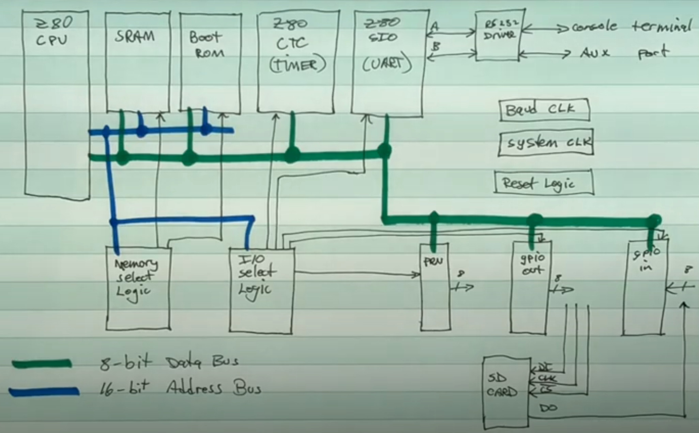
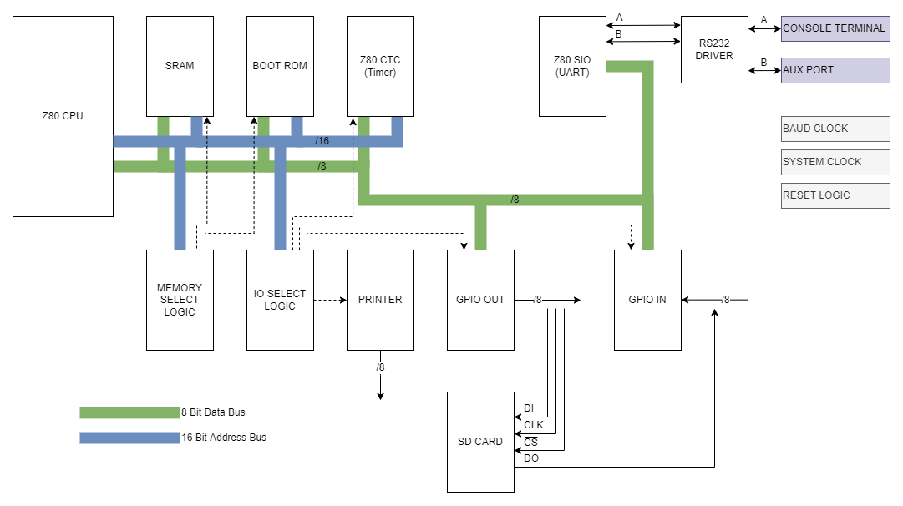
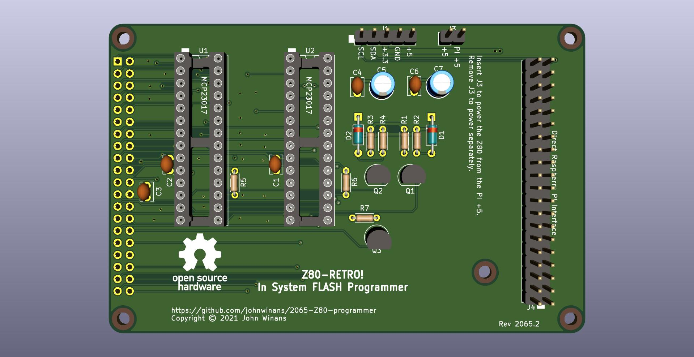
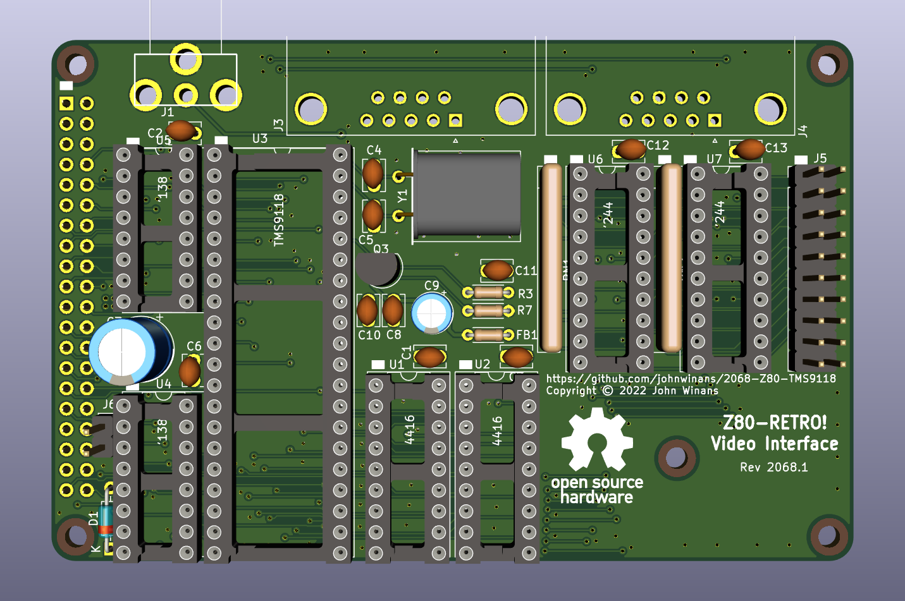

# Z80-Retro Architecture

[Back](./README.md)

## CPU Board Block Diagram

- _Video Link: [Z80 Retro #2 - Block Diagram](https://www.youtube.com/watch?v=0qr3FNo16Gg)_

The CPU Board is built around the Zilog 8 bit Z80 CPU.  It has a 16 bit wide
address bus which means it can address a maximum of 64KB of memory.

## Design Philosophy

John, the designer, has tried as much as possible to re-create the original
Single Board Computer hobby system that was so popular in the early eighties but
with a modern twist.  It is built almost entirely of modern components.  The Z80
Processors are still in production and all the logic ICs are still being made.
The only components that are either new old stock or second hand stock are the
VDP and the VDP Memory.  With the VDP being an _optional_ add-on, you could get
away with thinking that John has absolutely achieved this goal.

## Components

- CPU

  The CPU Board is built around the Zilog 8 bit Z80 CPU.  It has a 16 bit wide
  address bus which means it can address a maximum of 64kb of memory. It also
  has a separate IO Bus used to access peripherals.

- RAM

  512KB SRAM divided into 16 banks of 32KB each.

- FLASH

  128KB FLASH ROM.  The CPU boots from the flash ROM, which in turn is
  responsible for loading the first 32 blocks of storage from the SD Card into
  the TOP (Bank 15) bank of RAM and then jumping to the first address in that
  bank.

- CTC

  This a general purpose counter timer.  It has a selection of programmable
  timers that are used to drive the baud rates for serial communication via the
  CON and AUX RS232 ports.

- SIO

  A dial serial input output device which is connected to the RS232 chip.

- RS232

  Responsible for converting the TTL (5VT) logic signals into the +12VT / -12VT
  required for a standard RS232 connection.

- IO Address Decoder

  These ICs convert requested IO Addresses into chip enable signlals for the
  input buffer and the two D-Type latch devices.

- GP IO and Printer Out

  These chips are responsible for interfacing to the SD Card, Printer as well
  as holding the memory bank latch.
- SD CARD

  Block storage device interfaced over bit-banged SPI via the GPIO system.

- Power

  Power is provided through a USB Type B Connector on the board.  This connector only
  provides Power.  There is also an onboard voltage regulator that is used to
  provide 3.3VT to the SD Card adapter.

- System Clock

  A 10MHz Full Can Oscilator provides the 10MHz signal to the Z80 CPU.

- Baud Rate Clock

  Optionally divided by the CTC to allow for slower baud rates on the SIO.  By
  default, the Z80-Retro runs serial IO at 115200kbps.

- CPU Connector

  This connector is a 40pin header that can be used to interface with the two
  daughter boards.  It provides all the same signals as those on the CPU.

- Reset Circuit

  A momentary push button style switch that brings the RESET signal low while
  held down.  Used to COLD BOOT the CPU, reset the FLASH latch, and start
  everything up from scratch.

## External Input Output Interfaces

The Z80-Retro has 3 primary interfaces for communication with external devices.

- RS232 CON
  The main serial interface used to connect to the Z80-Retro over an RS232
  serial connection.  This is the default serial port to connect to your host
  PC via an IDC to DB9 adapter cable.
- RS232 AUX
  Used for auxillary serial communication.  The Baud rate of the AUX port can be
  programatically controlled to support slower rates for odler devies.
  Typically, one would use this to connect to another serial device or modem.
- Printer
  A 26pin IDC connector requiring an IDC to DB25 adapter cable to connecting to
  a line printer.

## Daughter Boards

There are two daughter boards available for the Z80-Retro.

### Raspberry Pi Flash Programmer

  

  This optional programmer is designed to interface directly to the Z80-Retro
  CPU Board and a standard Raspberry Pi Header.  When this is connected and you
  run the rquired tools, it will take direct control of the address and
  databuses by asserting the BUSREQ signal to the CPU.  Once it has control of
  the busses, it will program the 128kb FLASH ROM chip.

  It is also possible to program the FLASH ROM directly using another kind of
  programmer that supports the specific FLASH ROM device.

  The programmer has on board voltage level shifting to protect the 3.3VT pins
  on the Raspberry Pi.

### TMS9118 VDP Graphics card

  

  A graphics card for the Retro outputting a composite NTSC signal.  It has its
  own video memory and can be controlled by the CPU over the IO Bus.

## Operating System

The Z80-Retro is designed to work with CP/M version 2.2.  There are a range of
software options for CP/M 2.2 that can be loaded on to the SD Card and will work.

CP/M is designed as a serial only operating system and works very well on the
Z80 platform.  It is, therefore, the natural choice of OS.
