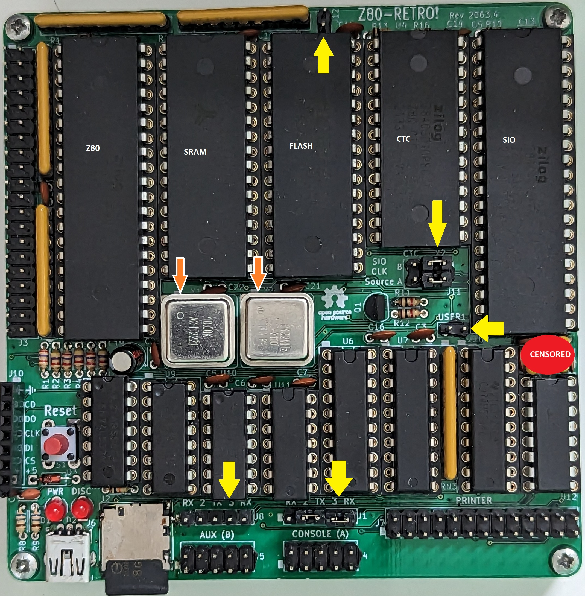

# Z80-Retro Hardware Build Guide

[Back](./README.md)

This document is not a "how to solder things" document nor is it going to get
into the intricacies of surface mount soldering techniques.

That said, here are some tips:

- Videos:
  - _Video Link: [Z80 Retro #33 - v4rc1 Full Build and Test pt. 1](https://youtu.be/X0ApysAFA7k)_
  - _Video Link: [Z80 Retro #34 - v4rc1 Full Build and Test pt. 2](https://youtu.be/aZyimz6YkGY)_

- Use good quality, machined sockets for the full can oscillators.
- Watch out when ordering the resistors.  They need to be the 1/8 watt type.
They are very small.  The more common 1/4 watt type will not fit well on the
board.  You can make them work, but it's gonna be messy.
- If you're struggling with the surface mounted SD Card socket, have a look at
the Sparkfun breakout board option.
- Some people even use sockets for the resistor networks.  This does raise them
up slightly but as resistor networks are more expensive, you might want to
consider using a socket for them too.
- Use ceramic MLCC Capacitors for the un-polarised capacitors.  An assortment
can be purchased from [Amazon](https://www.amazon.com/ceramic-capacitor-kit/s?k=ceramic+capacitor+kit).
Don't use tantalum capacitors like I did in the RS232 circuit.  While they do
work, they are polarised so care should be taken to install them correctly and
they are sensitive to voltage spikes and the risk of them popping is high.
**DON'T USE THEM.**
They are censored in the image below.
- Make sure your oscillator cans are oriented correctly.  Pin 1 is pointed to by
the orange arrows on the image below.
- You can use the cheaper socket types for everything but the oscillator cans.
(I used machined sockets because I am a nerd.)  It's not required.

## As Built CPU Board

## Jumper Settings

There are 5 sets of jumpers on the Z80-Retro marked in Yellow in the above
image.

<!-- markdownlint-disable -->
|Silk Screen      |Function                                                     |Default Config
|---------------- |------------------------------------------------------------ |---------------
|J1 - CONSOLE (A) |Primary serial connection to host PC                         |TX-PIN2,RX-PIN3
|J8 - AUX (B)     |Used for auxiliary serial connections                         |Unpopulated
|J11 - SIO/CTC    |Set SIO or CTC as clock source for CONSOLE (A) and AUX (B)   |Both set to X2
|J12              |Select a different bank on the Flash.                        |Unpopulated
|J9 - USER1       |General user input.  Assigned to bit 5 on GP Input.          |Unpopulated
<!-- markdownlint-restore -->
