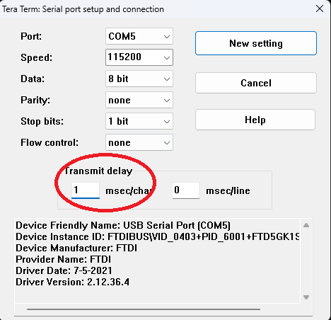
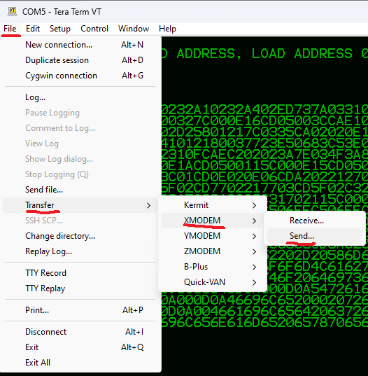
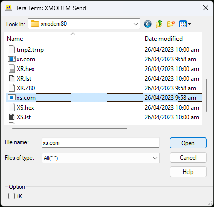
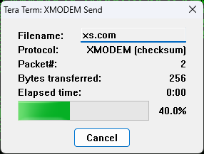

# Transfering Files to CP/M

[Back](./README.md)

There are a few different ways one can transfer files to CP/M over the serial
connection.

- Transfer them using `pip` over the existing serial connection
- Transfer them using `xmodem` over the existing serial connection

The following sections show how to compile XMODEM, transfer the binary in
intel hex format and then load it as a com file inside CP/M.  We then cover
how to use xmodem to transfer regular binary files from then on.

## Compile XMODEM

```bash
$ sudo apt-get install srecord

$ git clone https://github.com/Z80-Retro/xmodem80

$ cd xmodem80

$ make
```

Check that your XR.hex file looks like this.

```bash
$ cat XR.hex
:200100003A0200329E0232A10232A402ED737A0331040521A502CD5F023A5D00FE20CAF99F
:2001200001115C003E00327C000E16CD05003CCAE1013E01327E033EFE327F033E14327CA5
:20014000033E05CD2A02D25801217C0335CA02020E15CDA202C34101FE04CAC701FE18CA85
:200160000802FE01C241012180037723E50683C53E01CD2A02C1E17723E510F3E12183031D
:2001800006803E00862310FCAEC202023A7E034F3A8103B9C202023A7F034F3A8203B9C2E6
:2001A00002021183030E1ACD0500115C000E15CD0500FE00C2F301217E0334217F03350ED8
:2001C00006CDA202C33C01CD0E020E06CDA202212703CD5F02CD7702212F03CD5F02C3251E
:2001E00002214803CD5F02CD7702217703CD5F02C3250221DA02C31702216403CD5F02C318
:20020000250221F502C31702210C03C31702115C000E10CD0500C9CD5F02CD0E02115C0019
:200220000E13CD0500ED7B7A03C947C506FFC506FFC5CD9C02FE00C257022A00002A0000A5
:200240002A00002A00002A00002A0000C110E2C110DCC110D637C9CD9F02C1C1C1B7C97E40
:20026000B7C84FCDA20223C35F02C57E4FFE20C4A202C12310F4C93A5C00B7CA8902C64087
:200280004FCDA2020E3ACDA202215D000608CD6A020E2ECDA2020603CD6A02C9C306FFC3DD
:2002A00009FFC30CFF43502F4D205852202D20586D6F64656D2072656365697665207630EF
:2002C0002E32202F20536D616C6C526F6F6D4C61627320323031370D0A000D0A4661696CA3
:2002E00065642077726974696E6720746F206469736B0D0A000D0A5472616E736D73736951
:200300006F6E206661696C65640D0A000D0A5472616E736D697373696F6E2063616E636529
:200320006C6C65640D0A000D0A46696C6520002072656365697665642073756363657373CE
:2003400066756C6C790D0A004661696C6564206372656174696E672066696C65206E616D8C
:200360006564200046696C656E616D6520657870656365640D0A000D0A0000000000000047
:0405000000000000F7
:00000001FF
```

## Copy XMODEM to the Z80-Retro! Using PIP

You can use `pip` to copy files on CP/M between user areas and drives.  You can
also use it to transfer files from the host PC over the serial connection.

This example shows how to copy the xmodem binary in intel hex format from the
host PC to the A: drive.

It assumes you have a copy of the xmodem utility in intel hex format already.

First you will want to set-up your terminal to use a 1msec delay between chars.
If you past at full speed, the terminal will not keep up and you will loose data.

Set the Transmit delay to 1 msec/char and click New setting.  You might also
want to set the msec/line setting to 1 in case you encounter errors with the
process below.

Minicom also as a way to do this.  Read the manual.  These instructions are for
Terra Term on Windows.




When you are ready type: `pip xr.hex=con:` and then paste the hex data.

When the paste is finished, go ahead and press `CTRL+Z` to indicate to pip that
there is no more data to send.

```bash
a>pip xr.hex=con:
<paste hex data>
:200100003A0200329E0232A10232A402ED737A0331040521A502CD5F023A5D00FE20CAF99F
:2001200001115C003E00327C000E16CD05003CCAE1013E01327E033EFE327F033E14327CA5
:20014000033E05CD2A02D25801217C0335CA02020E15CDA202C34101FE04CAC701FE18CA85
:200160000802FE01C241012180037723E50683C53E01CD2A02C1E17723E510F3E12183031D
:2001800006803E00862310FCAEC202023A7E034F3A8103B9C202023A7F034F3A8203B9C2E6
:2001A00002021183030E1ACD0500115C000E15CD0500FE00C2F301217E0334217F03350ED8
:2001C00006CDA202C33C01CD0E020E06CDA202212703CD5F02CD7702212F03CD5F02C3251E
:2001E00002214803CD5F02CD7702217703CD5F02C3250221DA02C31702216403CD5F02C318
:20020000250221F502C31702210C03C31702115C000E10CD0500C9CD5F02CD0E02115C0019
:200220000E13CD0500ED7B7A03C947C506FFC506FFC5CD9C02FE00C257022A00002A0000A5
:200240002A00002A00002A00002A0000C110E2C110DCC110D637C9CD9F02C1C1C1B7C97E40
:20026000B7C84FCDA20223C35F02C57E4FFE20C4A202C12310F4C93A5C00B7CA8902C64087
:200280004FCDA2020E3ACDA202215D000608CD6A020E2ECDA2020603CD6A02C9C306FFC3DD
:2002A00009FFC30CFF43502F4D205852202D20586D6F64656D2072656365697665207630EF
:2002C0002E32202F20536D616C6C526F6F6D4C61627320323031370D0A000D0A4661696CA3
:2002E00065642077726974696E6720746F206469736B0D0A000D0A5472616E736D73736951
:200300006F6E206661696C65640D0A000D0A5472616E736D697373696F6E2063616E636529
:200320006C6C65640D0A000D0A46696C6520002072656365697665642073756363657373CE
:2003400066756C6C790D0A004661696C6564206372656174696E672066696C65206E616D8C
:200360006564200046696C656E616D6520657870656365640D0A000D0A0000000000000047
:0405000000000000F7<CTRL+Z>
```

Now you have a new `xr.hex` file on your disk.

You can validate it's correct by typing `type xr.hex`.

Next step is to convert the hex data into a `COM` file using the `LOAD`
utiltity.

```bash
a>load xr.hex


FIRST ADDRESS 0100
LAST  ADDRESS 0503
BYTES READ    0284
RECORDS WRITTEN 09

a>stat xr.com


 Recs  Bytes  Ext Acc
    9     2k    1 R/W A:XR.COM
Bytes Remaining On A: 7608k
```

If you want to you can delete the original hex file.

```bash
a>era xr.hex
```

## Use XMODEM to Transfer a File

*NOTE: I don't have minicom working to test this using minicom.*

- [ ] TODO: Convince someone else to write the minicom process.

The `xr.com` utility will let you transfer any files at a faster rate across
the serial connection.  This example shows how to load the `xs.com` binary file
that was also compiled in the xmodem repository.

Start with:

```bash
a> xr xs.com
```

The destination file name in this case will be xs.com.

Then use your serial tool to initiate an xmodem send.



Select the file you want to send.



Wait for the file to complete sending.



Here is how the whole process looks inside CP/M.

```bash
a>xr xs.com

CP/M XR - Xmodem receive v0.2 / SmallRoomLabs 2017
<initiate transfer as shown in the pictures>
File XS.COM received successfully

a>stat xs.com


 Recs  Bytes  Ext Acc
    5     2k    1 R/W A:XS.COM
Bytes Remaining On A: 7608k
```

The `xs.com` utiltiy is for receiving files from CP/M to the host computer.

It's almost the same process as for sending files to CP/M from the host
computer.  Just type `xs <filename to send>` and then initiate an XMODEM receive
in the terminal program.

```bash
a>xs xr.com
<initiate XMODEM receive, select path and name for file on host>
CP/M XS - Xmodem Send v0.1 / SmallRoomLabs 2017

File XR.COM sent successfully
```

The file will exist at the file path and name.
