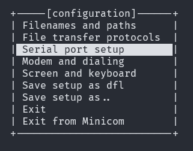
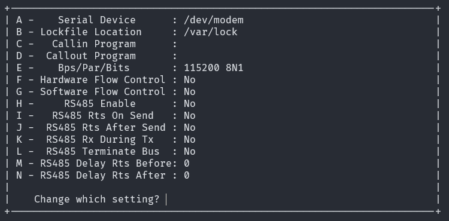
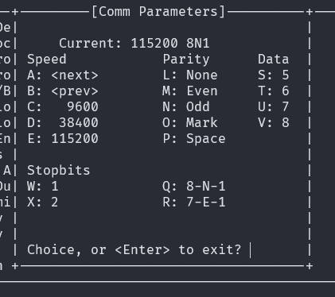
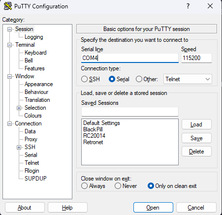
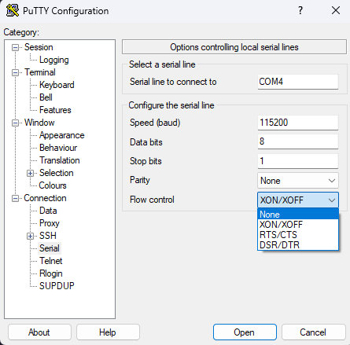

# Z80-Retro Terminal Settings

[Back](./README.md)

When you are ready to connect over serial to the Z80-Retro, you will need to
configure your chosen serial terminal emulator on your PC.  Perhaps you are so
retro, you have a _real_ serial terminal.  Either way, for the serial
connection to work, you must configure it properly.

The settings you need are: 115200 Baud 181N

    - 115200 baud
    - 1 Start Bit
    - 8 Data Bits
    - 1 Stop Bit
    - No Parity

    ALSO: Flow Control must be disabled.

## Minicom

First figure out what your FTDI or serial cable is enumerating as. I have a
RS232 to USB converter that I use and when I plug it into my Raspberry PI, it
shows up as `/dev/ttyUSB0`

```text
~ $ dmesg | grep -i ftdi
[  105.332745] usb 1-1.3: Manufacturer: FTDI
[  105.448945] usbcore: registered new interface driver ftdi_sio
[  105.449020] usbserial: USB Serial support registered for FTDI USB Serial Device
[  105.449288] ftdi_sio 1-1.3:1.0: FTDI USB Serial Device converter detected
[  105.457634] usb 1-1.3: FTDI USB Serial Device converter now attached to ttyUSB0
```

On a Raspberry PI and many other Linux based systems, the serial devices will
be automatically owned by the `dialout` group.

```text
~ $ ls -l /dev/ttyUSB0
crw-rw---- 1 root dialout 188, 0 Mar 14 14:10 /dev/ttyUSB0
```

So make sure your user account is a member of this group:

```text 
$ sudo usermod -a -G dialout YOUR USERNAME
$ id YOUR USERNAME
```

Make sure that you see the word `dialout` in the list of groups.

Next step is to configure Minicom:

Use sudo to run the setup tool as the defaults are saved into the /etc
directory.

```text
$ sudo minicom -s
```

An ncurses user interface will appear.  You can navigate it with arrow keys or
by typing the option key given.  Examples below.



Select the Serial Setup menu item.  Press ENTER



Press the "E" key to change the Bps/Par/Bits options.



Press "E" to select 115200 speed.

Press "Q" to select 8-N-1

Press "ENTER" to exit.

On the Serial Setup menu, press "F" and "G" until Hardware and Software flow
control are both set to "N" for None.

Press "ENTER" to go back to the main menu.

Arrow key down to "Save setup as dfl ..." and press "ENTER"

## Putty



First select Serial under "Connection type:"

Set Serial line to the name of your COM Port.  (assuming windows here)

Set Speed to 115200

Select "Serial" on the left hand side.



Make sure the following settings are configured:

- Data bits = 8
- Stop Bits = 1
- Parity = None
- Flow control = None


