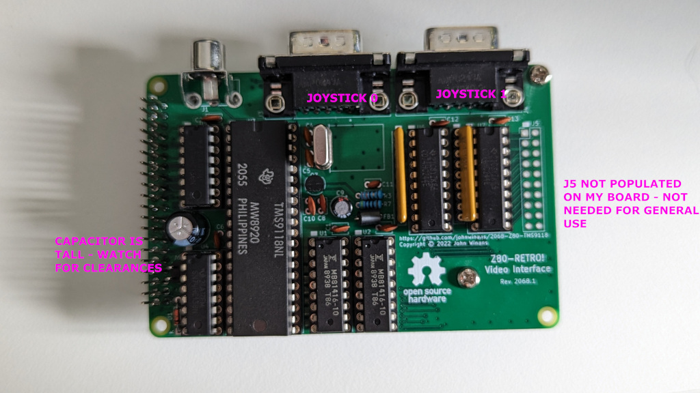
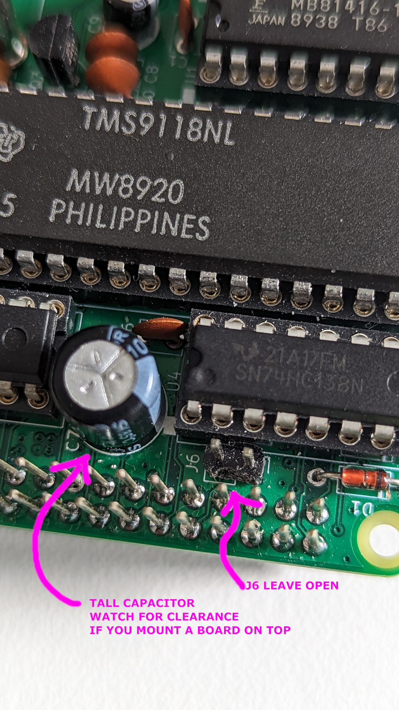
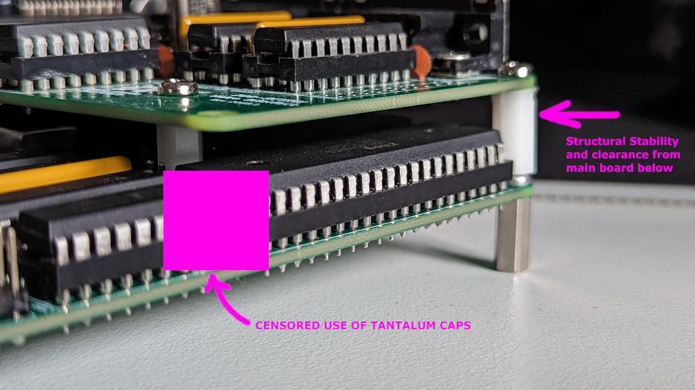
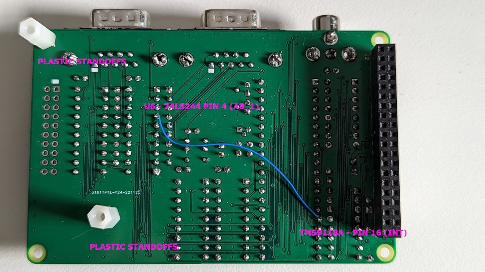

# Z80-Retro VDP Build Guide

The VDP Daughter Board is designed to be mounted on to the 40pin header on the
main board.  You can find the hardware build repository here: [2068-Z80-TMS9118](https://github.com/Z80-Retro/2068-Z80-TMS9118)

- Videos:
    - _Video Link: [NTSC Video Basics](https://www.youtube.com/watch?v=6Pc7uPGHKmU&list=PL3by7evD3F51Cf9QnsAEdgSQ4cz7HQZX5&index=63)_
    - _Video Link: [Z80 Retro #67 - Composite to HDMI Converter/Adapter](https://www.youtube.com/watch?v=5D_sUHx_HNw&list=PL3by7evD3F51Cf9QnsAEdgSQ4cz7HQZX5&index=76)_
    - REV 0 - DO NOT BUILD:
        - _Video Link: [Z80 Retro #44 - Contemplating the Addition of a TMS9118 Video Display Processor](https://www.youtube.com/watch?v=zcbBnogU0aY&list=PL3by7evD3F51Cf9QnsAEdgSQ4cz7HQZX5&index=50)_
        - _Video Link: [Z80 Retro #45 - TMS9118 VDP Breadboard Testing](https://www.youtube.com/watch?v=9JtpyNP3fwE&list=PL3by7evD3F51Cf9QnsAEdgSQ4cz7HQZX5&index=52)_
        - _Video Link: [Z80 Retro #47 - TMS9118 VDP Breadboard Testing The Z80 Retro! Interface](https://www.youtube.com/watch?v=F1Q4e410qLM&list=PL3by7evD3F51Cf9QnsAEdgSQ4cz7HQZX5&index=53)_
        - _Video Link: [Z80 Retro #49 - TMS9118 VDP First Draft Schematic & PCB for the Z80 Retro!](https://www.youtube.com/watch?v=uh7cpiRzfJ8&list=PL3by7evD3F51Cf9QnsAEdgSQ4cz7HQZX5&index=54)_
        - _Video Link: [Z80 Retro #48 - TMS9118 VDP Rev 0 PCB Build Spoiler: DO NOT BUILD!](https://www.youtube.com/watch?v=P-kQxyVBK74&list=PL3by7evD3F51Cf9QnsAEdgSQ4cz7HQZX5&index=55)_
        - _Video Link: [Z80 Retro #50 - TMS9118 VDP Rev 0 PCB Test pt. 1](https://www.youtube.com/watch?v=QBIHq2gtgaA&list=PL3by7evD3F51Cf9QnsAEdgSQ4cz7HQZX5&index=56)_
        - _Video Link: [Z80 Retro #51 - TMS9118 VDP Rev 0 PCB Test pt. 2](https://www.youtube.com/watch?v=7tfHO4yQMOE&list=PL3by7evD3F51Cf9QnsAEdgSQ4cz7HQZX5&index=57)_
        - _Video Link: [Z80 Retro TMS9118 VDP Breaking News!](https://www.youtube.com/watch?v=G4dgYXWm9tc&list=PL3by7evD3F51Cf9QnsAEdgSQ4cz7HQZX5&index=58)_
        - _Video Link: [Z80 Retro #52 - TMS9118 VDP Rev 0 PCB Test pt. 3 (Joystick)](https://www.youtube.com/watch?v=0MDg2rQyCxM&list=PL3by7evD3F51Cf9QnsAEdgSQ4cz7HQZX5&index=59)_
        - _Video Link: [Z80 Retro #53 - TMS9118 VDP Rev 0 PCB Test pt. 4 (IRQs)](https://www.youtube.com/watch?v=nexfjxNYKMs&list=PL3by7evD3F51Cf9QnsAEdgSQ4cz7HQZX5&index=60)_
        - _Video Link: [Z80 Retro #54 - TMS9118 VDP Rev 0 PCB Test pt. 4a (IRQs and DDT)](https://www.youtube.com/watch?v=lf-Pj2qZxd0&list=PL3by7evD3F51Cf9QnsAEdgSQ4cz7HQZX5&index=62)_
    - REV 1:
        - _Video Link: [Z80 Retro #55 - TMS9118 VDP Rev 1 PCB Test](https://www.youtube.com/watch?v=SDP98iAlwj4&list=PL3by7evD3F51Cf9QnsAEdgSQ4cz7HQZX5&index=61)_
        - _Video Link: [Z80 Retro #56 - TMS9118 VDP Graphics Mode 1](https://www.youtube.com/watch?v=3qVPRbLy-MA&list=PL3by7evD3F51Cf9QnsAEdgSQ4cz7HQZX5&index=64)_
        - _Video Link: [Z80 Retro #57 - TMS9118 VDP Sprites](https://www.youtube.com/watch?v=otuP12ESDXM&list=PL3by7evD3F51Cf9QnsAEdgSQ4cz7HQZX5&index=65)_
        - _Video Link: [Z80 Retro #58 - TMS9118 VDP Frame Flag Race Condition?](https://www.youtube.com/watch?v=-1njuXj0pVA&list=PL3by7evD3F51Cf9QnsAEdgSQ4cz7HQZX5&index=66)_
        - _Video Link: [Z80 Retro #71 - VDP Board Issues Posted to Github](https://www.youtube.com/watch?v=ydhs7XTiszw&list=PL3by7evD3F51Cf9QnsAEdgSQ4cz7HQZX5&index=80)_
    - REV 2:
        - _Video Link: [Z80 Retro #72 - VDP Board Rev 2 Upgrade]()_ comming soon to a youtube near you.

The same guidelines as noted in: [Z80-Retro Hardware Build Guide](./Z80-RETRO-BUILD.md)
apply here.

The README in the hardware project provides a detailed BOM and information on
where to source the TMS9118A processor from.  Note: You can _NOT_ use a TMS9918A
in this build as it requires 8x4k RAM chips.  The TMS9118A only requires 2x16k
ram chips which are easier to find and allow for a smaller board footprint.

## Mounting the board

When you go to mount the board on on to the main board, pay careful attention to
the clearance below.  Make sure that the crystal oscillators do not touch any
of the solder joints on the VDP board.

The mounting holes on the right hand side of the VDP board are located such that
stand-offs can be installed to ensure a robust clearance below.  Alternatively,
you can insert a layer of cardboard between the boards.

Should you wish to deploy the Raspberry PI Programmer Board on top of the VDP,
please check your clearances between the programmer and the components on VDP.
In particular, the electrolytic capacitor at C7 could be too high.

This is discussed in the "Z80 Retro #71 - VDP Board Issues Posted to Github"
video linked above.

In any event, due to the thermodynamics of these TMS chips discussed in the next
paragraph, you should not leave the programmer board permanently connected
above the VDP.

## Heat

Up until now, everything you know and have learned about CMOS circuits will be
that they should be cool to the touch when in operation.  This is not the case
with the TMS9118A or the two '1416 64kbit RAM chips.  They will get quite warm.
Not so hot as to burn you, but warm to the tough.  Keep the boards well
ventilated and you will be fine.  If you want, to you can add some heat sinks
to these 3 chips.  If you intend to install the Z80-Retro! into an enclosure,
it is recommended to install heat sinks and even some active airflow.

## As Built Image

_**NOTE:** I do not have J5 Populated._








## The Rev 2 Bodge

The main reason for developing and including the TMS VDP Board is to play games
on the Z80-Retro!  Games of any era rely heavily on accurate timing for both
frame rendering and smooth game play.

The typical way that this is achieved on the TMS9118A, is through observing the
VSYNC Status of the device.  The TMS9118A generates a low going interrupt
signal on pin 16 every 60th (1/60) of a second.  Thus if the software running on
the retro is able to keep up, one could conceivably have a game that renders at
60FPS! Not bad for devices made over 40 years ago!

The Z80-Retro! does not enable interrupts in any way in the default CP/M BIOS.

It is perfectly acceptable to develop for interrupt usage, so long as you pick
Interrupt Mode 1 on the Z80 as this is the only interrupt mode that will work
with the TMS9118A.

Another way to "notice" when the TMS9118A is asserting the interrupt is to poll
the Status Register on the TMS until it returns 1 on the most significant bit.

In C this looks something like this.

```c
while (IO_VDPLATCH == 0) { ; }
```

Unfortunately, testing and measuring has shown this method to often result in
skipped frames which results in very poor game performance.  This is probably
because the act of reading the register also clears the interrupt status.  Thus
the race condition discussed in some detail here: - _Video Link: 
[Z80 Retro #58 - TMS9118 VDP Frame Flag Race Condition?](https://www.youtube.com/watch?v=-1njuXj0pVA&list=PL3by7evD3F51Cf9QnsAEdgSQ4cz7HQZX5&index=66)_

As a workaround to this and still not using interrupts, we can apply a small
bodge to the REV 1 VDP Board, which allows for programs to monitor the status
of the interrupt PIN on the TMS9118A without reading the status flag.  Turns out
the Joystick Buffers have some free bits available that are not used by the joy-
stick ports.  We can assign one of the free pins on Joystick 0 (I/O PORT A8) to
this purpose.

Now with the bodge applied, the test for vertical sync interrupt looks like
this:

```c
  void vdp_waitVDPReadyInt() {
    while ((IO_JOY0 & 0x02) != 0)
      ;
    vdpStatusRegVal = IO_VDPLATCH;
  }
```

This works because the Joystick Buffers have all of their inputs pulled up by
10k resistors.  When the TMS pulls the line low, the result of the bit mask
will be 0 and we can _know_ that a vertical sync event has occurred and use
this data to time everything in our games.

Here is an image of the bodge applied.



TODO: [ ] Add link to video that describes the bodge and demo's the results of
applying it to games.

The REV 2 Board currently in development provides this link in the copper traces
as well as offering a new Jumper (J7) to optionally enable or disable it.

[Back](./README.md)
