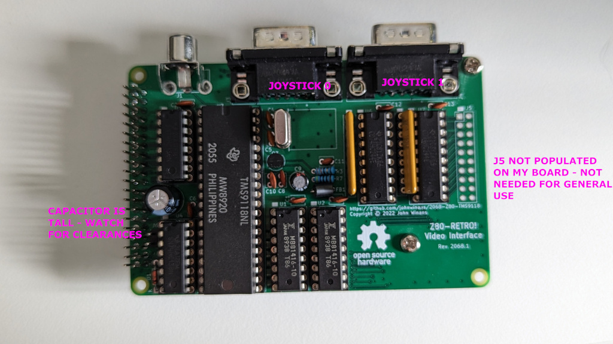
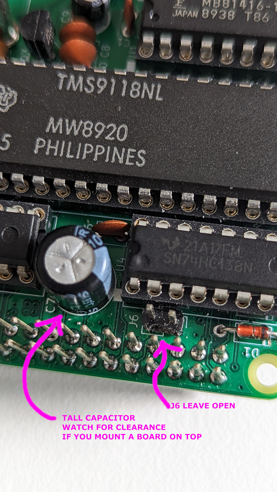

# Z80-Retro VDP Build Guide

The VDP Daughter Board is designed to be mounted on to the 40pin header on the
main board.  You can find the hardware build repository here: [2068-Z80-TMS9118](https://github.com/Z80-Retro/2068-Z80-TMS9118)

- Videos:
  - _Video Link: [NTSC Video Basics](https://www.youtube.com/watch?v=6Pc7uPGHKmU&list=PL3by7evD3F51Cf9QnsAEdgSQ4cz7HQZX5&index=63)_
  - _Video Link: [Z80 Retro #67 - Composite to HDMI Converter/Adapter](https://www.youtube.com/watch?v=5D_sUHx_HNw&list=PL3by7evD3F51Cf9QnsAEdgSQ4cz7HQZX5&index=76)_
  - REV 0 - DO NOT BUILD:
    - _Video Link: [Z80 Retro #44 - Contemplating the Addition of a TMS9118 Video Display Processor](https://www.youtube.com/watch?v=zcbBnogU0aY&list=PL3by7evD3F51Cf9QnsAEdgSQ4cz7HQZX5&index=50)_
    - _Video Link: [Z80 Retro #45 - TMS9118 VDP Breadboard Testing](https://www.youtube.com/watch?v=9JtpyNP3fwE&list=PL3by7evD3F51Cf9QnsAEdgSQ4cz7HQZX5&index=52)_
    - _Video Link: [Z80 Retro #47 - TMS9118 VDP Breadboard Testing The Z80 Retro! Interface](https://www.youtube.com/watch?v=F1Q4e410qLM&list=PL3by7evD3F51Cf9QnsAEdgSQ4cz7HQZX5&index=53)_
    - _Video Link: [Z80 Retro #49 - TMS9118 VDP First Draft Schematic & PCB for the Z80 Retro](https://www.youtube.com/watch?v=uh7cpiRzfJ8&list=PL3by7evD3F51Cf9QnsAEdgSQ4cz7HQZX5&index=54)_
    - _Video Link: [Z80 Retro #48 - TMS9118 VDP Rev 0 PCB Build Spoiler: DO NOT BUILD!](https://www.youtube.com/watch?v=P-kQxyVBK74&list=PL3by7evD3F51Cf9QnsAEdgSQ4cz7HQZX5&index=55)_
    - _Video Link: [Z80 Retro #50 - TMS9118 VDP Rev 0 PCB Test pt. 1](https://www.youtube.com/watch?v=QBIHq2gtgaA&list=PL3by7evD3F51Cf9QnsAEdgSQ4cz7HQZX5&index=56)_
    - _Video Link: [Z80 Retro #51 - TMS9118 VDP Rev 0 PCB Test pt. 2](https://www.youtube.com/watch?v=7tfHO4yQMOE&list=PL3by7evD3F51Cf9QnsAEdgSQ4cz7HQZX5&index=57)_
    - _Video Link: [Z80 Retro TMS9118 VDP Breaking News!](https://www.youtube.com/watch?v=G4dgYXWm9tc&list=PL3by7evD3F51Cf9QnsAEdgSQ4cz7HQZX5&index=58)_
    - _Video Link: [Z80 Retro #52 - TMS9118 VDP Rev 0 PCB Test pt. 3 (Joystick)](https://www.youtube.com/watch?v=0MDg2rQyCxM&list=PL3by7evD3F51Cf9QnsAEdgSQ4cz7HQZX5&index=59)_
    - _Video Link: [Z80 Retro #53 - TMS9118 VDP Rev 0 PCB Test pt. 4 (IRQs)](https://www.youtube.com/watch?v=nexfjxNYKMs&list=PL3by7evD3F51Cf9QnsAEdgSQ4cz7HQZX5&index=60)_
    - _Video Link: [Z80 Retro #54 - TMS9118 VDP Rev 0 PCB Test pt. 4a (IRQs and DDT)](https://www.youtube.com/watch?v=lf-Pj2qZxd0&list=PL3by7evD3F51Cf9QnsAEdgSQ4cz7HQZX5&index=62)_
  - REV 1:
    - _Video Link: [Z80 Retro #55 - TMS9118 VDP Rev 1 PCB Test](https://www.youtube.com/watch?v=SDP98iAlwj4&list=PL3by7evD3F51Cf9QnsAEdgSQ4cz7HQZX5&index=61)_
    - _Video Link: [Z80 Retro #56 - TMS9118 VDP Graphics Mode 1](https://www.youtube.com/watch?v=3qVPRbLy-MA&list=PL3by7evD3F51Cf9QnsAEdgSQ4cz7HQZX5&index=64)_
    - _Video Link: [Z80 Retro #57 - TMS9118 VDP Sprites](https://www.youtube.com/watch?v=otuP12ESDXM&list=PL3by7evD3F51Cf9QnsAEdgSQ4cz7HQZX5&index=65)_
    - _Video Link: [Z80 Retro #58 - TMS9118 VDP Frame Flag Race Condition?](https://www.youtube.com/watch?v=-1njuXj0pVA&list=PL3by7evD3F51Cf9QnsAEdgSQ4cz7HQZX5&index=66)_
    - _Video Link: [Z80 Retro #71 - VDP Board Issues Posted to Github](https://www.youtube.com/watch?v=ydhs7XTiszw&list=PL3by7evD3F51Cf9QnsAEdgSQ4cz7HQZX5&index=80)_
  - REV 2:
    - _Video Link: [Z80 Retro #72 - VDP Board Rev 2.1 Upgrade](https://youtu.be/Urhld15coNs?si=W0uQBXha0dMox7BH)_

The same guidelines as noted in: [Z80-Retro Hardware Build Guide](./Z80-RETRO-BUILD.md)
apply here.

The README in the hardware project provides a detailed BOM and information on
where to source the TMS9118A processor from.  Note: You can _NOT_ use a TMS9918A
in this build as it requires 8x4k RAM chips.  The TMS9118A only requires 2x16k
ram chips which are easier to find and allow for a smaller board footprint.

## Mounting the board

When you go to mount the board on on to the main board, pay careful attention to
the clearance below.  Make sure that the crystal oscillators do not touch any
of the solder joints on the VDP board.

The mounting holes on the right hand side of the VDP board are located such that
stand-offs can be installed to ensure a robust clearance below.  Alternatively,
you can insert a layer of cardboard between the boards.

Should you wish to deploy the Raspberry PI Programmer Board on top of the VDP,
please check your clearances between the programmer and the components on VDP.
In particular, the electrolytic capacitor at C7 could be too high.

This is discussed in the "Z80 Retro #71 - VDP Board Issues Posted to Github"
video linked above.

In any event, due to the thermodynamics of these TMS chips discussed in the next
paragraph, you should not leave the programmer board permanently connected
above the VDP.

## Heat

Up until now, everything you know and have learned about CMOS circuits will be
that they should be cool to the touch when in operation.  This is not the case
with the TMS9118A or the two '1416 64 kbit RAM chips.  They will get quite warm.
Not so hot as to burn you, but warm to the tough.  Keep the boards well
ventilated and you will be fine.  If you want, to you can add some heat sinks
to these 3 chips.  If you intend to install the Z80-Retro! into an enclosure,
it is recommended to install heat sinks and even some active airflow.

## As Built Image

_**NOTE:** I do not have J5 Populated._

[Back](./README.md)

<!-- vim: set tw=80 cc=80 ft=markdown et: -->
